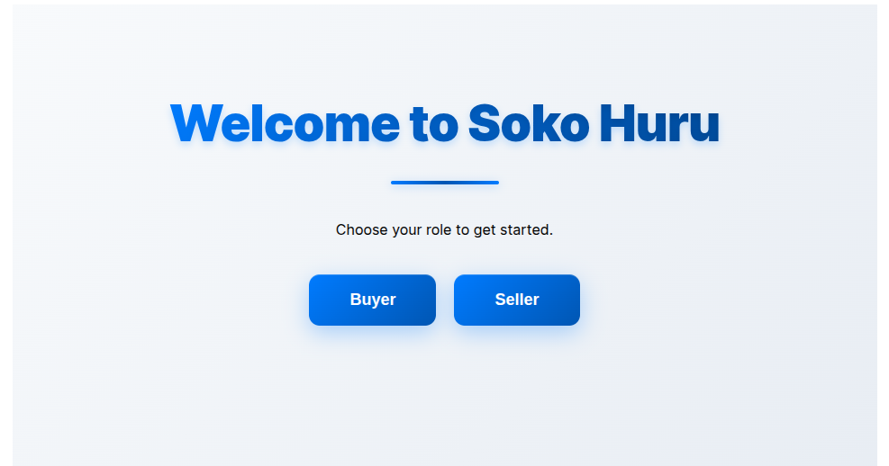

# Soko Huru
## Description
Soko Huru is a simple web application that is designed to connect buyers to sellers of different products when one logs in. The app supports user authentication and also sign up for new users who want to use the service.
## Screenshots & Features
### HomePage
Access the seller or buyer login pages from the Homepage

## View the site live

visit the site at: [soko-huru](peaceful-churros-a037ef.netlify.app)

### Seller's Side
- Log in and manage your products as  a seller that is by adding new products for advertising and editing existing product details.
- Also remove out of stock products by deleting items
- Edit your company details through the profile form
#### Seller Login Page

### Seller Product Page

### Seller New-Product and Profile forms

### Buyer's Side 

- Sign up if a new user or log in if you already have an account
- View the different item listings of different sellers
- Browse products by different sellers and details
- Contact sellers of the product(s) of interest and get in touch with them.
### Buyer Login page

### Buyer Product Page

## How to use
### Requirements
To use this application, you will need a computer, tablet or phone and access to internet
### View Live site
You may access the live site of this application [here]()

- Able to contact sellers of the product of interest

### Seller Side

- Log in and manage products that is by adding new products and editing existing products
- Also remove out of stock products

## Technologies Used
  
  - React
  - CSS
  - JSON Server

  ## How to Setup

 1. Clone this repository
       
        git clone git@github.com:d0nn-opsbyte/soko-huru-project.git
        
 2. Install the Dependencies
     
        npm install
 3. Start the Backend (JSON Server)

        npm start   
 4. Start the React App
      
        npm run dev

   
    ### Authors

    1. Donald Kiarie
    2. Rodney Karani
    3. Dennis Karanja
   
## Related Repositories

### Backend API

Deployed API:[live API URL](https://soko-huru-json-server.onrender.com)

 ## Contributions

 Contributions are welcome. Feel free to submit a pull request for improvement.

## Contacts

+254 700 123456

Email: info@sokohuru.com

&copy; 2025

   
    
      
    
